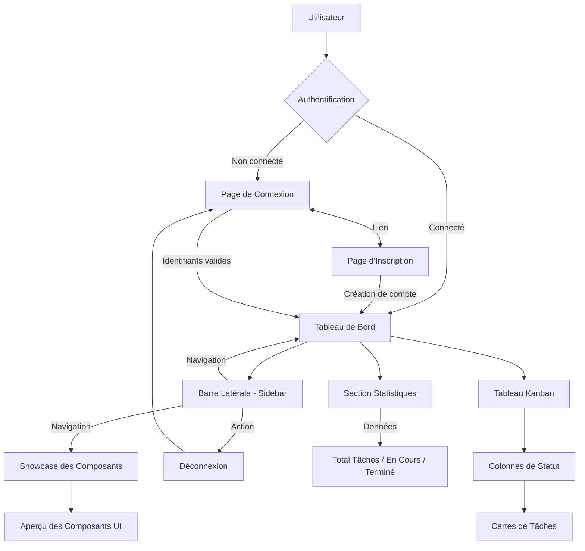

# Diagramme Fonctionnel - TaskFlow

Ce document décrit les interactions entre les différents composants de l'application et le flux utilisateur.

## Architecture Visuelle

## Flux de l'Application

## Interactions des Services

- **Navigation** : Gérée par `React Router`, permettant des transitions instantanées entre les vues sans recharger la page.
- **État UI** : Utilisation de `useState` et des props React pour la communication entre les composants parents (Pages) et enfants (Task Cards, Stats Cards).
- **Design System** : Utilisation de `Tailwind CSS` pour un rendu visuel cohérent sur tout le site.
