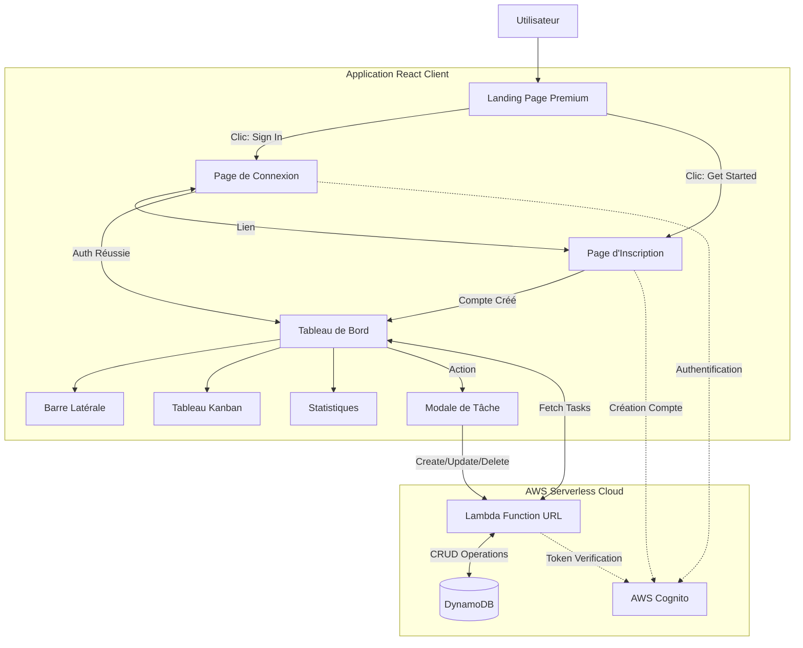

# Diagramme Fonctionnel - TaskFlow

Ce document décrit les interactions entre les différents composants de l'application et le flux utilisateur.

## Architecture Visuelle

## Flux de l'Application

## Interactions des Services

- **Navigation** : Gérée par `React Router`, permettant des transitions instantanées entre les vues sans recharger la page.
- **Gestion du Drag & Drop** : Utilisation de `react-dnd` pour synchroniser l'UI avec l'état des tâches lors des déplacements.
- **Gestion Complète des Tâches** : Utilisation de modales `Dialog` (Radix UI) pour la création, l'édition détaillée (titre, tags, dates, commentaires) et la suppression des tâches.
- **État Global (Simulé)** : Utilisation de `useState` dans le Dashboard pour centraliser la liste des tâches et assurer la cohérence visuelle après chaque action utilisateur (immédiateté des mises à jour).
- **Design System** : Utilisation de `Tailwind CSS 4` pour un rendu visuel premium et cohérent sur tout le site.
